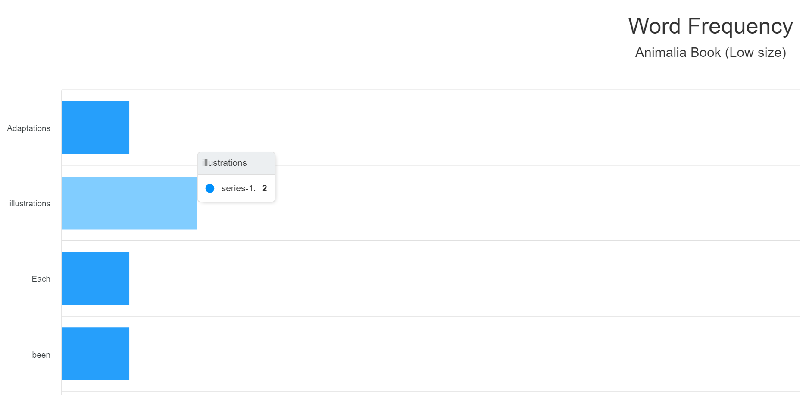
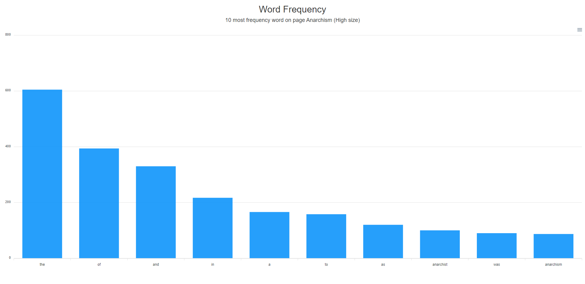
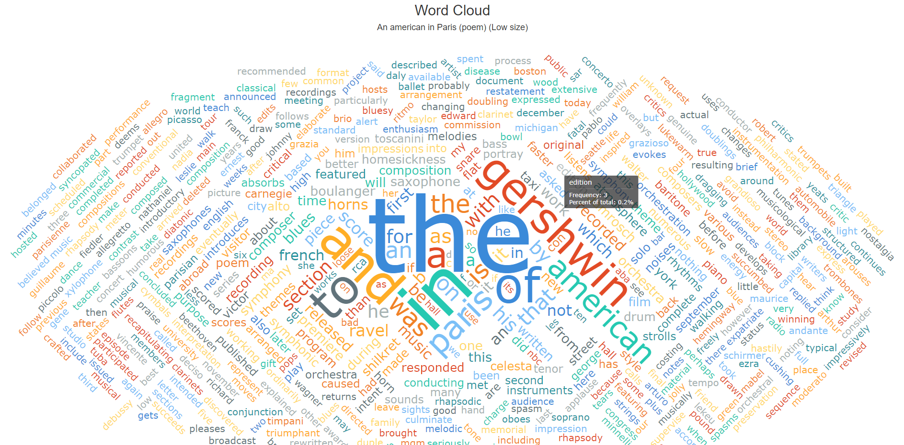
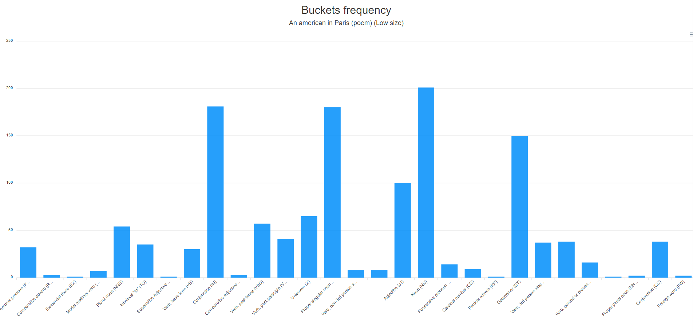
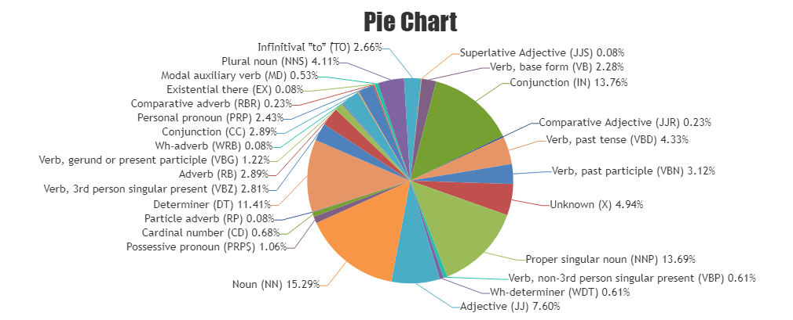

# Assignment_web_data
This small app is used to compute some statistics on a file. The format of the file is based on a preprocessed warc file which contains the data from several wikipedia pages. From the initial warc file the words has been extracted (with the [PageParser.java](src/main/java/com/assignment/assignment_web_data/data/PageParser.java)) to create new files with the text. It is not required to run the PageParser because the new parsed files are still in the app (I only added it for completeness). The PageParser outputs 2 file types, the first is composed by the text of the wikipdia page and the second with also the tag information used for the fifth point of the assignment.
The app is devided into 2 parts, the first is the home where the user selects the page to compute and the action to perform, the second part shows the output (word frequency, word cloud and so on).
## Word frequency
This action shows the word frequency from the selected wikipedia page.  
Screenshot: 

## 10 most/least word frequency
This action shows the 10 most or least word frequency.  
Screenshot: 

## Create a word cloud
This function creates a word cloud with the words of the selected page. The size of the word reflects the frequency of the word itself. 
Screenshot: 

## Bucketing
This part creates a frequency based on the tag of the warc file third column. These tags contain information about the type of the word (like adjective, noun, verb etc.).  
Screenshot: 

Pie chart: 

